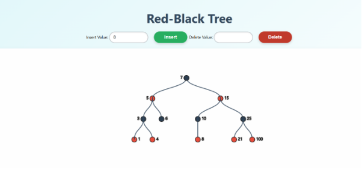

DSA Eksamensprojekt Red-Black Tree - Lucas

Som en del af mit eksamensprojekt har jeg implementeret et Red-Black Tree, som er et selvbalancerende binært søgetræ-algoritme. Min implementering gør det muligt at indsætte og slette tal, så man kan observere, hvordan algoritmen løbende balancerer træet. Hver gang man tilføjer eller fjerner en værdi, visualiserer modellen de nødvendige omrokeringer og farveændringer, der sikrer, at træet forbliver balanceret og overholder dets regler.

Links til projekt:

Deploy: https://unstabel.github.io/reeksamen-DSA/

Repository: https://github.com/Unstabel/reeksamen-DSA
